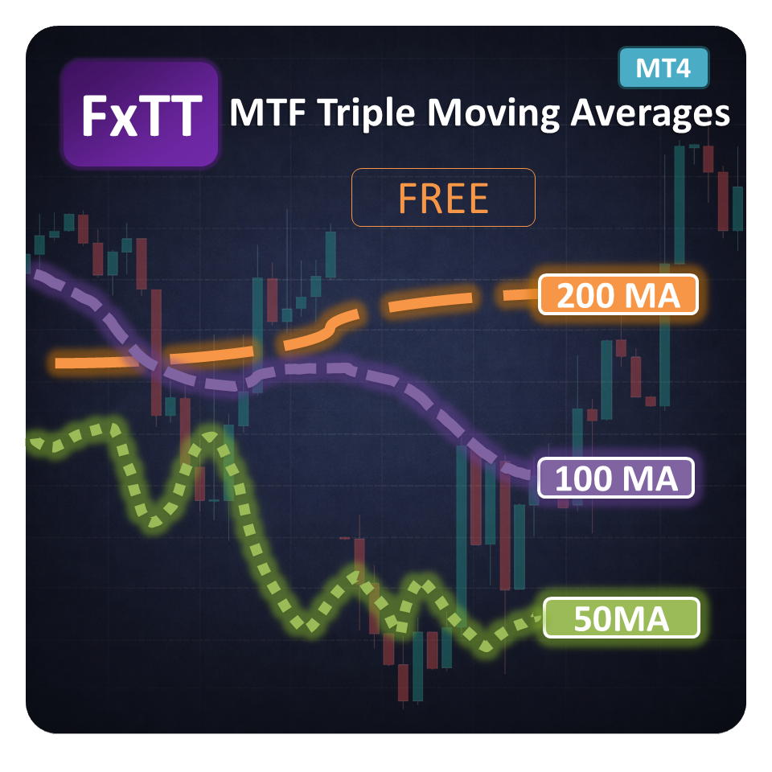

# MTF Triple Moving Averages MT4 — Free Multi-Timeframe Indicator


> **MTF Triple MA MT4** projects Fast, Medium, and Slow moving averages from nine standard timeframes onto one MetaTrader 4 chart. Use the draggable on-chart panel to enable the timeframes that matter to your analysis.



**Product page:** [forextradingtools.eu/en/marketplace/mtf-triple-ma](https://forextradingtools.eu/en/marketplace/mtf-triple-ma)

## Overview

The indicator keeps higher-timeframe trend context visible while you work on an execution chart. Each source timeframe supplies three independently period-configurable averages (Fast, Medium, and Slow), mapped onto the active chart. The panel provides one-click timeframe visibility controls, automatic lower-timeframe filtering, collapse/expand, and drag positioning.

This is a visual analysis indicator. It does not open, close, or manage trades.

## Features

- Three moving averages per timeframe: Fast, Medium, and Slow
- Nine standard MT4 timeframes on one chart: M1, M5, M15, M30, H1, H4, D1, W1, and MN1
- Independent Fast, Medium, and Slow period inputs
- SMA, EMA, SMMA, and LWMA method support
- Close, Open, High, Low, Median, Typical, and Weighted applied-price support
- MA shift support for projecting the averages horizontally
- Timeframe-specific colours and role-specific line styles: dotted Fast, dashed Medium, solid Slow
- Draggable, collapsible control panel with one-click timeframe toggles
- Lower source timeframes are marked unavailable for the active chart to keep the display readable
- Optional right-side labels showing each visible MA and its period
- Chart-specific panel position, expanded state, and visibility preferences are retained

## Supported Timeframes

| Source timeframe | Label | Disabled automatically when the chart is… |
|---|---|---|
| Monthly | MN1 | Above MN1 (not applicable on standard charts) |
| Weekly | W1 | MN1 |
| Daily | D1 | W1 or MN1 |
| 4-hour | H4 | D1 or higher |
| 1-hour | H1 | H4 or higher |
| 30-minute | M30 | H1 or higher |
| 15-minute | M15 | M30 or higher |
| 5-minute | M5 | M15 or higher |
| 1-minute | M1 | M5 or higher |

MT4 standard charts support M1 through MN1. Broker history must be available for the source timeframe before its values can be calculated. Offline and custom timeframes are not part of this indicator's supported set.

## Installation

### Using a compiled file

1. Download the compiled `.ex4` release from the [GitHub Releases](https://github.com/ForexTradingTools/fxtt-mt4-mtf-triple-moving-averages/releases) page when available.
2. In MetaTrader 4, select **File → Open Data Folder**.
3. Open `MQL4/Indicators/` and copy `MTF_Triple_MA.ex4` there.
4. Restart MT4, or right-click **Navigator → Indicators** and choose **Refresh**.
5. Drag **MTF_Triple_MA** from the Navigator onto a chart and click **OK**.

### Compiling the source

The complete self-contained source is in [`src/MTF_Triple_MA.mq4`](src/MTF_Triple_MA.mq4). Open it in MetaEditor, press **Compile**, then install the generated `MTF_Triple_MA.ex4` into `MQL4/Indicators/` as above. The `releases/` directory is reserved for compiled distribution binaries; this repository intentionally does not include a fabricated binary.

## Settings Reference

### Moving averages

| Input | Default | Description |
|---|---:|---|
| `InpFastPeriod` | 50 | Fast MA lookback period. |
| `InpMedPeriod` | 100 | Medium MA lookback period. |
| `InpSlowPeriod` | 200 | Slow MA lookback period. |
| `InpMAMethod` | EMA | Calculation method: SMA, EMA, SMMA, or LWMA. Applied to all three MA roles. |
| `InpMAPrice` | Close | Applied price: Close, Open, High, Low, Median, Typical, or Weighted. Applied to all three MA roles. |
| `InpMAShift` | 0 | Horizontal MA displacement in bars; positive values move the line right. Applied to all three MA roles. |

Fast, Medium, and Slow periods are independently configurable. MT4's standard indicator inputs use one common method, applied price, and shift for the three roles; line colour/style/width follow the fixed timeframe and role conventions described above.

### Panel and labels

| Input | Default | Description |
|---|---:|---|
| `InpPanelX` | 20 | Initial panel distance from the left edge in pixels. |
| `InpPanelY` | 30 | Initial panel distance from the top edge in pixels. |
| `InpShowLabels` | true | Show the current right-side label for each visible MA. |
| `InpLabelShiftBars` | 1 | Number of chart bars to place labels to the right of the latest bar. |
| `InpLabelFontSize` | 8 | Label font size. |

After attaching the indicator, drag the **Triple MA Panel** header to move it. Click the header to collapse or expand it, and click a timeframe row to toggle all three MAs from that source timeframe. Preferences are stored per chart and indicator instance.

## How to Use

1. Attach the indicator to the chart where you make entries.
2. Keep D1/H4/H1 enabled when you want broad-to-intraday trend context; disable rows that add noise.
3. Read Fast above Medium above Slow as bullish alignment, and the reverse order as bearish alignment.
4. Watch higher-timeframe averages as potential dynamic support or resistance during pullbacks.
5. Combine MA structure with price action and a defined risk plan. The indicator is not a standalone signal generator.

## Compatibility

- **Platform:** MetaTrader 4, standard M1–MN1 charts
- **File type:** `.ex4` compiled indicator or `.mq4` source
- **Recommended terminal:** Current MT4 builds with MQL4 event and chart-object support
- **Operating systems:** Windows, or MT4 running through a compatible Wine/CrossOver setup or VPS
- **Instruments:** Forex, metals, indices, crypto, and other symbols supplied by the broker
- **Expert Advisors:** Visual-only; it does not place or manage orders and can run alongside EAs
- **Data:** Source timeframe history must be downloaded by the terminal/broker
- **MT5:** Use the [MTF Triple Moving Averages MT5](https://github.com/ForexTradingTools/fxtt-mt5-mtf-triple-moving-averages) repository instead

## Repository Layout

```text
fxtt-mt4-mtf-triple-moving-averages/
├── src/
│   └── MTF_Triple_MA.mq4       # Complete self-contained MQL4 source
├── releases/                   # Compiled .ex4 distribution files
├── screenshots/
│   └── mtf-triple-ma-mt4.png   # MT4 product screenshot
├── LICENSE                     # MIT License
└── README.md
```

## Changelog

### 2.00 — September 2026

- MT4 port of the FxTT MTF Triple MA indicator
- Nine standard timeframe layers with three MA buffers per layer
- Draggable/collapsible panel with persistent visibility and position state
- Independent Fast, Medium, and Slow periods
- Optional right-side MA labels and lower-timeframe eligibility filtering

## Related FxTT Repositories

- [MTF Bollinger Bands MT4](https://github.com/ForexTradingTools/fxtt-mt4-mtf-bollinger-bands)
- [MTF Bollinger Bands MT5](https://github.com/ForexTradingTools/fxtt-mt5-mtf-bollinger-bands)
- [MTF Triple Moving Averages MT5](https://github.com/ForexTradingTools/fxtt-mt5-mtf-triple-moving-averages)
- [Strategy Checklist MT4](https://github.com/ForexTradingTools/fxtt-mt4-strategy-checklist)
- [Strategy Checklist MT5](https://github.com/ForexTradingTools/fxtt-mt5-strategy-checklist)
- [Forex Scanner MT4](https://github.com/ForexTradingTools/fxtt-mt4-forex-scanner)
- [Forex Scanner MT5](https://github.com/ForexTradingTools/fxtt-mt5-forex-scanner)
- [Pivot Points MT5](https://github.com/ForexTradingTools/fxtt-mt5-pivot-points)
- [Session High/Low MT5](https://github.com/ForexTradingTools/fxtt-mt5-session-high-low)
- [News Calendar MT5](https://github.com/ForexTradingTools/fxtt-mt5-news-calendar)
- [ZigZag Zones MT5](https://github.com/ForexTradingTools/fxtt-mt5-zig-zag-zones)

More free tools are listed on [ForexTradingTools.eu](https://forextradingtools.eu).

## License

This project is released under the [MIT License](LICENSE). You may use, copy, modify, and distribute the source, provided the copyright and license notices are retained.

© 2026 [Forex Trading Tools](https://forextradingtools.eu)
